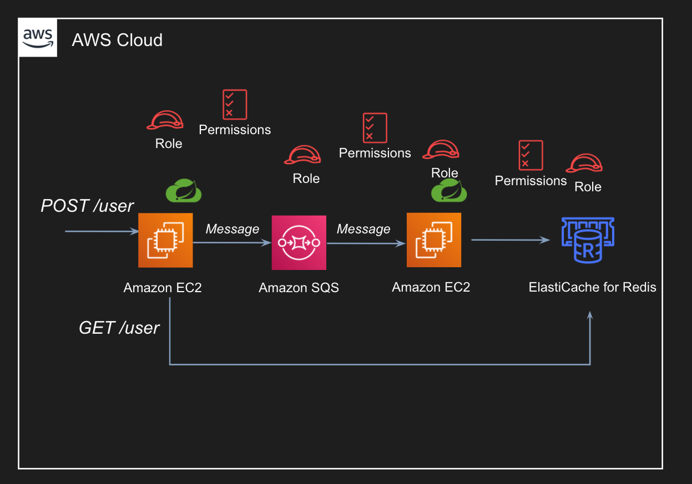

# Spring Cloud AWS Example with SQS and ElastiCache using Redis

## Endpoints
- POST `/user` - Add new user to Cache 
- GET `/user?id=1` - Retrieve user from Cache
- GET `/user/all` - Retrieve all users from Cache

## Architecture 
